# System Architecture

> Technical design and system flow for TechBuddy — an AI companion that helps elderly people use their computer through natural conversation, powered by Claude Opus 4.6.

<p align="center">
  
</p>

---

## High-Level Overview

```mermaid
%%{init: {'theme': 'base', 'themeVariables': { 'primaryColor': '#3E2723', 'primaryTextColor': '#FFF8F0', 'primaryBorderColor': '#4CAF50', 'lineColor': '#FFCC80', 'secondaryColor': '#5D4037', 'tertiaryColor': '#3E2723'}}}%%

flowchart TB
    subgraph Input ["User Input"]
        VOICE["🎙️ Voice\n(Web Speech API)"]
        TEXT["⌨️ Text\n(Chat Window)"]
        SMS["📱 Family SMS\n(Twilio / Simulate)"]
    end

    subgraph Frontend ["Flask Chat UI"]
        UI["chat.html\n20px fonts · 48px buttons\nAnimated avatar · TTS"]
    end

    subgraph Backend ["Flask Server (app.py)"]
        SESSION["Server-Side Sessions\n(UUID-keyed history)"]
        CLAUDE["Claude Opus 4.6 API\nExtended thinking · Prompt caching\n35 tool schemas · 10-round loop"]
    end

    subgraph Dispatch ["Tool Dispatch (screen_dispatch.py)"]
        direction LR
        EMAIL["📧 Email\n(Gmail IMAP)"]
        FILES["📁 Files &\nApps"]
        SCAM["🛡️ Scam\nShield"]
        VISION["👁️ Vision\n(Desktop + iPhone)"]
        SYSTEM["🔧 System\nHealth"]
        MEMORY["💾 Local\nMemory"]
        WEB["🔍 Web\nSearch"]
        PHONE["📱 iPhone\nControl"]
    end

    subgraph External ["External Systems"]
        GMAIL["Gmail IMAP"]
        WIN["Windows Desktop\n(win32com · pywinauto\nPowerShell)"]
        MAC["MacinCloud\niOS Simulator\n(Cloudflare Tunnel)"]
    end

    VOICE --> UI
    TEXT --> UI
    SMS --> SESSION

    UI --> SESSION
    SESSION --> CLAUDE
    CLAUDE --> Dispatch

    EMAIL --> GMAIL
    FILES --> WIN
    SCAM --> WEB
    VISION --> WIN
    VISION --> MAC
    SYSTEM --> WIN
    PHONE --> MAC
```



---

## Claude Opus 4.6: The Brain

TechBuddy's tools are hands and eyes. **Claude Opus 4.6 is the mind.**

Every user interaction — every spoken question, every typed message, every family SMS — routes through a single Claude Opus 4.6 API call. The model reads the user's intent, decides which tools to call, interprets results, decides what to do next, and writes the final response in a warm, jargon-free voice. The Flask server orchestrates the loop. The dispatch layer executes tool calls. But every judgment call — what to do, when to warn, how to explain — comes from Opus 4.6.

### How Opus 4.6 Drives Every Interaction

When a user says "check my email," here's what happens inside the model's reasoning:

1. Opus 4.6 reads the message and decides to call `check_email()`
2. Tool returns 3 emails — Opus 4.6 reads them and spots suspicious content in one
3. Opus 4.6 autonomously decides to call `analyze_scam_risk()` on the suspicious email
4. Scam analysis triggers a **nested Opus 4.6 call** with its own extended thinking for deep fraud reasoning
5. Opus 4.6 sees the scam verdict, decides to call `search_web()` to verify the sender's claims
6. With all evidence gathered, Opus 4.6 writes a warm, clear warning: what's suspicious, what to do, and the real phone number to call instead

**No code told it to do steps 2-6.** The 10-round tool-use loop gives Opus 4.6 space to reason through multi-step problems autonomously. The model decides when to investigate further, when to verify, and when it has enough information to respond.

### Five Opus 4.6 Capabilities in Production

| Capability | How TechBuddy Uses It |
|------------|----------------------|
| **Extended Thinking (Adaptive)** | Active on every API call. Scam Shield Layer 3 uses a *nested* Opus 4.6 call with its own extended thinking for multi-step fraud analysis. Thinking traces surfaced in UI so family can verify reasoning. |
| **Vision (2 pipelines)** | PIL screenshots of Windows desktop + xcrun screenshots of iPhone via Cloudflare Tunnel. Opus 4.6 interprets what's on screen, identifies UI elements, and guides the user step-by-step. |
| **Tool Use (35 tools, 10 rounds)** | Opus 4.6 autonomously selects and chains tools across rounds. It reads tool results, decides next actions, handles errors by trying alternatives — all emergent from the model's reasoning, not hardcoded logic. |
| **Prompt Caching** | The system message (personality definition + 35 tool schemas + scam rules + accessibility rules) is cached with `cache_control: {"type": "ephemeral"}` for faster repeat calls within a session. |
| **Personality via System Prompt** | Opus 4.6's warm, patient, jargon-free personality is shaped entirely by the system prompt — including when to proactively offer help, how to format email summaries, when to use bold warnings vs gentle suggestions, and the rule to always confirm before sending, deleting, or taking financial action. |

The dispatch layer is deterministic — `open_application("Word")` always calls `win32com.client.Dispatch("Word.Application")`. But **which tools to call, in what order, and how to interpret results for an elderly user** — that's all Opus 4.6.

---

## Component Breakdown

### 1. Flask Chat UI (`frontend/templates/chat.html`)
**Purpose:** Accessible voice + text interface for elderly users

**Technology:** Single-file HTML/CSS/JS — no build step, no framework

**Key Details:**
- 20px base font, 48px+ button targets, 4.5:1 WCAG AA contrast
- Warm cream palette (#FFF8F0 background, soft blue/peach/green message bubbles)
- Web Speech API for voice input, Kokoro TTS (port 5050) with browser fallback
- Animated SVG avatar: idle floating, thinking sway, speaking bob, random blinking
- Collapsible "See what I was considering..." thinking trace on assistant messages
- Per-message replay button, speed toggle (1.0x / 0.7x), mute toggle
- Family SMS demo panel with contact dropdown and send button

### 2. Flask Server (`frontend/app.py`)
**Purpose:** Orchestrates the conversation loop between user and Claude Opus 4.6

**Technology:** Flask 3.0+, Anthropic Python SDK

**Key Details:**
- **Claude Opus 4.6 is the sole decision-maker** in the tool-use loop — it reads the user's message, selects which tools to call, interprets results, and decides whether to call more tools or respond. The Flask server orchestrates the loop; the intelligence is entirely in the model.
- **Server-side sessions:** UUID-keyed `_conversation_histories` dict (replaced 4KB cookie limit)
- **`call_claude()`:** Up to 10 rounds of tool-use loop — Opus 4.6 calls tools, gets results, reasons about next steps, calls more tools
- **Extended thinking:** `thinking: {"type": "adaptive"}` on every API call — Opus 4.6 dynamically allocates reasoning depth based on task complexity
- **Prompt caching:** `cache_control: {"type": "ephemeral"}` on the system message — caches the personality + 35 tool schemas for faster repeat calls
- **System prompt:** The personality layer that makes Opus 4.6 into TechBuddy — warm tone, 35 tool schemas, scam protection rules, email display rules, proactive troubleshooting behavior, and the rule to never use jargon
- **`_strip_image_data()`:** Replaces base64 screenshots with `[screenshot taken]` in stored history
- **`_compact_history()`:** Keeps recent exchanges intact, strips old thinking/tool blocks
- **Family SMS endpoints:** `/sms/simulate` (demo), `/sms/incoming` (Twilio webhook), `/family/messages` (polling)

### 3. Tool Dispatch Layer (`mcp_servers/screen_dispatch.py`)
**Purpose:** 35 tool implementations with tiered fallback architecture

**Technology:** Python with win32com, pywinauto, PowerShell, imaplib, PIL, requests

**Key Details:**
- **Tiered fallback:** win32com (Tier 1, ~100% reliable) → pywinauto (Tier 2) → MCP (Tier 3) → Claude Vision (Tier 4)
- **Gmail IMAP:** Real email via app password, `SINCE` date filter to avoid >1MB crash, quoted folder names for spaces
- **Scam Shield:** 3-layer pipeline (keyword scan → web verification → extended thinking analysis)
- **Vision:** PIL.ImageGrab for desktop screenshots, MacinCloud xcrun for iPhone screenshots
- **Word automation:** win32com `Selection.TypeText()` for reliable cursor focus
- **Local memory:** Plain-text .md files in `~/TechBuddy Notes/` — never cloud, always local

### 4. Scam Shield Pipeline
**Purpose:** Protect elderly users from fraud ($4.8B lost in 2024)

**Technology:** Keyword matching, DuckDuckGo web search, nested Claude Opus 4.6 call with extended thinking

**Key Details:**
- Runs automatically on every email read — no user action required
- Three layers execute in sequence; stops early if Layer 1 returns SAFE
- **Layer 3 demonstrates the deepest use of Opus 4.6 in the system:** a *nested* API call where Opus 4.6 receives all evidence (keyword flags, web verification results, full email content) and uses extended thinking to reason step-by-step about whether this is a scam — analyzing sender legitimacy, urgency patterns, financial requests, and impersonation signals
- Thinking trace surfaced in UI so family members can verify the AI's reasoning — this transparency is only possible because Opus 4.6's extended thinking externalizes the model's reasoning process
- Extended thinking is what makes TechBuddy's scam protection genuinely protective rather than superficial — the model reasons about *why* something is suspicious, not just *whether* it matches a keyword

### 5. iOS Phone Control
**Purpose:** Cross-device assistance — desktop and iPhone from one interface

**Technology:** MacinCloud iOS Simulator, xcrun simctl, Cloudflare Tunnel, Flask

**Key Details:**
- Mac-side Flask server runs on MacinCloud PAYG instance
- Cloudflare Tunnel exposes it to TechBuddy via `PHONE_SERVER_URL`
- Three endpoints: `/screenshot` (GET), `/tap` (POST x,y), `/launch` (POST app name)
- Working apps: Settings, Messages, Safari, Photos, Calendar, Maps

---

## Data Flow

### Chat Message Flow


### Scam Detection Flow


### Family SMS Flow

```mermaid
%%{init: {'theme': 'base', 'themeVariables': { 'primaryColor': '#3E2723', 'primaryTextColor': '#FFF8F0', 'primaryBorderColor': '#4CAF50', 'lineColor': '#5D4037', 'secondaryColor': '#5D4037', 'signalColor': '#3E2723', 'signalTextColor': '#3E2723', 'labelTextColor': '#3E2723', 'actorTextColor': '#FFF8F0', 'noteBkgColor': '#FFCC80', 'noteTextColor': '#3E2723'}}}%%

sequenceDiagram
    participant Daughter as Sarah (SMS)
    participant Flask as Flask Server
    participant Claude as Claude Opus 4.6
    participant Tools as Tool Dispatch
    participant Mom as Mom's Chat UI

    Daughter->>Flask: POST /sms/simulate "check mom's email"
    Flask-->>Daughter: "Got it, helping now..."

    Note over Flask: Background thread
    Flask->>Flask: Check permissions (can_execute?)
    Flask->>Claude: [FAMILY REMOTE REQUEST] + message
    Claude->>Tools: check_email()
    Tools-->>Claude: 3 new emails, 1 scam detected
    Claude-->>Flask: SMS reply (truncated to 1500 chars)

    Flask-->>Daughter: "Mom has 3 emails — warned about scam"
    Flask->>Mom: Green notification: "Sarah checked in!"
```



---

## Tiered Fallback Architecture

The core design principle: **never show an error when a fallback exists.**

```mermaid
%%{init: {'theme': 'base', 'themeVariables': { 'primaryColor': '#3E2723', 'primaryTextColor': '#FFF8F0', 'primaryBorderColor': '#4CAF50', 'lineColor': '#5D4037', 'secondaryColor': '#5D4037', 'tertiaryColor': '#3E2723'}}}%%

flowchart TB
    USER["Open Word and type a letter"] --> T1

    T1["Tier 1: win32com — ~100%"]
    T1 -->|FAIL| T2["Tier 2: pywinauto — ~85%"]
    T2 -->|FAIL| T3["Tier 3: MCP Server — ~95%"]
    T3 -->|FAIL| T4["Tier 4: Claude Vision — 100%"]

    style T1 fill:#4CAF50,color:#FFF8F0
    style T2 fill:#5D4037,color:#FFF8F0
    style T3 fill:#5D4037,color:#FFF8F0
    style T4 fill:#8D6E63,color:#FFF8F0
    style USER fill:#3E2723,color:#FFF8F0
```



**Who decides which tier?** Claude Opus 4.6. The model reads the user's request, evaluates which tools are appropriate, and calls them. If Tier 1 (win32com) returns an error, Opus 4.6 sees the error in the tool result and autonomously decides to try Tier 2. If all automation fails, Opus 4.6 calls `read_my_screen()` to see what's happening and guides the user through it. The fallback logic isn't hardcoded — it emerges from the model's reasoning about what to do when a tool fails.

**Why not Computer Use API?** Anthropic's Computer Use API scores 22% on desktop tasks. Deterministic automation via win32com scores ~100%. We give Opus 4.6 reliable tools instead of asking it to guess pixel coordinates. The model's intelligence is better spent on understanding user intent and reasoning about scams than on clicking buttons.

---

## Technology Stack

| Layer | Technology | Rationale |
|-------|------------|-----------|
| **Frontend** | Single-file HTML/CSS/JS | Zero build step, simple deployment, no framework complexity for a single-page app |
| **Web Server** | Flask 3.0 | Lightweight, sufficient for single-user local app, excellent Python ecosystem integration |
| **AI Model** | Claude Opus 4.6 | Extended thinking for scam reasoning, vision for screen reading, 35-tool dispatch, prompt caching |
| **Windows Automation** | win32com + pywinauto | win32com for direct Office control (~100% reliable), pywinauto for general UI automation |
| **System Diagnostics** | PowerShell via subprocess | Native Windows system info (Get-CimInstance, Get-Process, netsh) |
| **Email** | imaplib (Gmail IMAP) | Direct IMAP with app password — no third-party email APIs, works with any Gmail account |
| **Scam Web Verification** | ddgs (DuckDuckGo) | No API key required, privacy-respecting, sufficient for verification searches |
| **Desktop Vision** | PIL (ImageGrab) | Native Windows screenshot capture, resize for token efficiency, base64 for Claude Vision |
| **iPhone Vision** | xcrun simctl (via tunnel) | iOS Simulator screenshot and tap commands, tunneled from MacinCloud via Cloudflare |
| **Voice Input** | Web Speech API | Built into browsers, zero dependencies, works offline in Chrome |
| **Voice Output** | Kokoro TTS + browser fallback | Natural-sounding speech on WSL port 5050, browser Speech Synthesis as fallback |
| **Local Memory** | Plain-text .md files | No database needed, human-readable, family can inspect files directly, never in cloud |
| **Testing** | pytest | 139 tests across 5 test files, mocked external dependencies |

---

## Design Decisions

### Why Tiered Fallback Instead of Computer Use API?
Computer Use API is elegant but unreliable (22% desktop success). Elderly users can't tolerate "it works sometimes." The tiered approach gives near-100% reliability for common tasks (open Word, type text, save PDF) while falling back to vision guidance for uncommon situations. This is the opposite of a research demo — it's built for someone who will panic if something doesn't work.

### Why Single-File HTML Instead of React?
The UI is one page with one purpose: chat. React adds a build step, node_modules, and complexity that provides zero benefit for a single-page chat interface. The single HTML file is 1,157 lines — large but self-contained. Anyone can open it, understand it, and modify it.

### Why Flask Instead of FastAPI?
TechBuddy is a local app for one user. Flask's synchronous model is simpler and sufficient. Server-side sessions use a plain dict. There's no need for async request handling, WebSocket scaling, or OpenAPI schema generation. Flask gets out of the way.

### Why Server-Side Sessions Instead of Cookies?
Flask's client-side cookies have a 4KB limit. Claude's extended thinking blocks can be 5-30KB each. After 2-3 exchanges with vision (base64 screenshots), the cookie overflows and the session silently drops. Server-side storage via UUID-keyed dict has no size limit and reduces the cookie to ~36 bytes.

### Why Real Gmail IMAP Instead of a Custom Email UI?
Judges expect "it works" — not simulated demos. Real Gmail IMAP with app password connects to actual email. The simulated inbox (6 demo emails including a scam) is available as a fallback when Gmail credentials aren't configured, but the production path is real email.

### Why Local Memory Instead of a Database?
TechBuddy's users are elderly people who value privacy and simplicity. Plain-text .md files in `~/TechBuddy Notes/` are human-readable, inspectable by family members, backed up by normal file backups, and never sent to any cloud service. A database would add complexity with no user benefit.

---

## Claude Code Primitives

TechBuddy uses all available Claude Code development primitives:

| Primitive | Files | Purpose |
|-----------|-------|---------|
| **CLAUDE.md** | `CLAUDE.md` | 75-line project blueprint — architecture, tools, accessibility standards, gotchas |
| **Rules** | `.claude/rules/` (3 files) | Accessibility WCAG standards, hook development rules, MCP server design rules |
| **Hooks** | `hooks/` (3 scripts) | PreToolUse: validate sends. PostToolUse: accessibility check. Stop: session safety verify |
| **Skills** | `.claude/skills/` (4 configs) | Interface design, frontend design, accessibility checking, elderly-prompt formatting |
| **Subagents** | `.claude/agents/` (5 configs) | Email, files, photos, printing, video calls — specialized development context agents |
| **MCP Servers** | `.mcp.json` (2 servers) | Filesystem (NPX standard), screen-dispatch (custom Python, 35 tools) |

---

## Project Structure

```
techbuddy/
├── CLAUDE.md                         # Project blueprint (75 lines)
├── ARCHITECTURE.md                   # This file
├── .mcp.json                         # MCP server configuration
├── .env.example                      # Environment variable template
├── .claude/
│   ├── settings.json                 # Hooks, permissions
│   ├── rules/                        # 3 rule files (accessibility, hooks, MCP)
│   ├── agents/                       # 5 subagent configs
│   └── skills/                       # 4 skill configs
├── frontend/
│   ├── app.py                        # Flask server + Claude API (1,044 lines)
│   ├── requirements.txt              # Python dependencies
│   └── templates/
│       └── chat.html                 # Full UI (1,157 lines)
├── mcp_servers/
│   └── screen_dispatch.py            # 35 tool implementations (2,772 lines)
├── hooks/
│   ├── validate_send.py              # PreToolUse: block scam sends
│   ├── accessibility_check.py        # PostToolUse: font/jargon checks
│   └── verify_elderly_safe.py        # Stop: session safety verification
└── tests/                            # 143 tests (1,183 lines)
    ├── test_dispatch.py              # 74 tests — tool dispatch
    ├── test_app.py                   # 30 tests — Flask routes
    ├── test_sms.py                   # 16 tests — Family SMS
    ├── test_hooks.py                 # 16 tests — hook scripts
    ├── test_word_workflow.py          # 7 tests — Word automation
    └── conftest.py                   # Shared fixtures
```

---

*Architecture designed for reliability, accessibility, and elderly safety — every design decision prioritizes "it just works" over elegance.*
