<p align="center">
  
</p>

> Eight real problems from six days of building TechBuddy. Each one looked simple on the surface. None of them were.

<p align="center">
  <a href="README.md"></a>
  <a href="ARCHITECTURE.md"></a>
  <a href="LEARNINGS.md"></a>
  <a href="CLAUDE_CODE.md"></a>
</p>

TechBuddy is built for Anthropic's **Built with Opus 4.6** hackathon. Every challenge below involves Claude Opus 4.6 — the brain that makes every decision, the reasoning engine behind scam detection, the vision system that reads screens, and the personality that speaks to elderly users with patience and warmth. The tools are hands and eyes. Opus 4.6 is the mind.

### Challenge Timeline

```mermaid
%%{init: {'theme': 'base', 'themeVariables': { 'primaryColor': '#3E2723', 'primaryTextColor': '#FFF8F0', 'primaryBorderColor': '#4CAF50', 'lineColor': '#FFCC80', 'secondaryColor': '#5D4037', 'tertiaryColor': '#3E2723'}}}%%

gantt
    title 8 Challenges Across 6 Days
    dateFormat X
    axisFormat %s
    section Day 1
        Computer Use API 22%           :c1, 0, 1
    section Day 3
        Extended Thinking API           :c2, 2, 3
        .env CRLF invisible char        :c3, 2, 3
        Piper TTS clips audio           :c4, 2, 3
    section Day 4
        PIL black on RDP                :c5, 3, 4
    section Day 5
        pywinauto focus loss            :c6, 4, 5
    section Day 6
        Cookie overflow 582KB           :c7, 5, 6
        Gmail IMAP folder names         :c8, 5, 6
```



---

## Challenge 1: Computer Use API Scores 22% on Desktop
**Day 1 — The Architectural Pivot**

### The Problem
The initial TechBuddy architecture was designed around Anthropic's Computer Use API — the official tool for AI-controlled desktop interaction. The concept was elegant: Claude sees the screen, moves the mouse, clicks buttons, types text. One API, complete computer control.

The first prototype used Computer Use to open Word, type a letter, and save it. It worked — sometimes. On repeated testing across common elderly tasks (open an application, type text, find a file, print a document), the success rate settled at **22%**.

For a developer tool, 22% is a starting point. For an 80-year-old who will panic if something doesn't work, 22% is a non-starter.

### The Trap (What Didn't Work)
The obvious fix was to improve the prompts. More specific instructions. Better screen descriptions. Retry logic. This is the standard approach for unreliable AI — make it try harder.

Prompt engineering moved the needle from 22% to maybe 30%. Retries added latency. And the fundamental problem remained: the API was interpreting screenshots and guessing where to click, when the correct coordinates and actions were knowable in advance.

### The Investigation
The realization came from watching what Computer Use was actually doing: it was taking a screenshot, identifying the Word icon, estimating its pixel coordinates, and clicking. But we *know* where Word is — it's a COM object we can instantiate directly. We don't need to find a button on screen to click it. We can call the API that the button calls.

This reframed the entire architecture. The question wasn't "how do we make AI see the screen better?" It was "why are we using vision when we have direct access?"

### The Solution
Built a four-tier fallback architecture:

| Tier | Technology | Success Rate | Use Case |
|------|-----------|-------------|----------|
| 1 | **win32com** (COM Automation) | ~100% | Word, Excel, Outlook — direct API calls |
| 2 | **pywinauto** (UI Automation) | ~85% | General Windows apps — find windows, click buttons |
| 3 | **MCP Servers** (Filesystem) | ~95% | File operations — read, write, list, search |
| 4 | **Claude Vision** (Fallback) | 100% | Anything else — screenshot + guide the user |

Tier 1 handles the most common elderly tasks (documents, email) with near-perfect reliability. Tier 4 ensures nothing is ever impossible — if automation can't reach it, Claude sees the screen and talks the user through it.

### The Outcome
Common task success rate went from **22% to ~100%**. The architectural pivot defined the entire project — every subsequent feature was built on deterministic automation first, vision second. This became TechBuddy's core design principle: **never show an error when a fallback exists.**

Critically, Opus 4.6 remains the brain in the new architecture. The model decides which tools to call, interprets every result, and autonomously falls back to lower tiers when something fails. The tiered tools gave Opus 4.6 reliable hands — but the intelligence that decides *what to do* and *how to explain it* is entirely in the model.

---

## Challenge 2: Extended Thinking Rejects budget_tokens
**Day 3 — The API Mismatch**

### The Problem
TechBuddy's scam detection pipeline uses a nested Claude API call — an inner call with extended thinking specifically for deep reasoning about whether an email is a scam. On Day 3, this inner call started returning **HTTP 400 errors** with no useful error message.

The main chat loop worked fine. Only the scam analysis call failed.

### The Trap (What Didn't Work)
The scam analysis call used `thinking: {"type": "enabled", "budget_tokens": 10000}` — the format documented in existing examples and tutorials. This worked in earlier API versions. The assumption was that the API key or model version was wrong.

Hours of debugging: checking API keys, model names, SDK versions. The key was valid (the main loop used the same key). The model was correct. The SDK was current.

### The Investigation
Isolated the failing parameter by stripping the API call down to the minimum. The call succeeded with `thinking: {"type": "enabled"}` but failed with `thinking: {"type": "enabled", "budget_tokens": 10000}`. Then discovered that `adaptive` mode — a newer option — didn't accept `budget_tokens` at all.

The Anthropic API had introduced `"type": "adaptive"` as the recommended thinking mode for Opus 4.6. Adaptive mode dynamically allocates thinking budget based on task complexity. Passing `budget_tokens` to adaptive mode is an error — it contradicts the "adaptive" concept.

### The Solution
Changed all thinking parameters to:
```python
thinking={"type": "adaptive"}
```
No `budget_tokens`. No `type: "enabled"`. Two words. Both the main chat loop and the nested scam analysis call use identical thinking configuration.

### The Outcome
Extended thinking works on **every API call** — main loop and scam analysis. The adaptive mode actually produces better reasoning than a fixed budget because Opus 4.6 dynamically allocates more thinking to harder problems (like ambiguous scam emails) and less to simple queries. The scam pipeline's thinking trace is now surfaced in the UI so family members can verify the AI's reasoning. Extended thinking is what makes TechBuddy's scam protection genuinely protective rather than superficial — the model doesn't just flag keywords, it *reasons* about why something is dangerous.

---

## Challenge 3: .env CRLF Line Endings Break the API Key
**Day 3 — The Invisible Character**

### The Problem
Day 3. Flask starts, loads the `.env` file, prints the API key — looks correct. First API call: `"Invalid API key"`. Copied the key directly from the Anthropic console. Pasted it again. Same error.

The key worked in curl from a Mac. It worked when hardcoded in Python. It only failed when loaded from the `.env` file on WSL.

### The Trap (What Didn't Work)
The debugging instinct was to check the key itself: is it expired? Is it the wrong project? Is there a whitespace issue? Standard `print(api_key)` showed the correct key. `len()` returned the expected length... plus 1. But that was easy to miss in a sea of debugging output.

Regenerated the key. Same problem. Created a new project. Same problem. The key was always correct — the loading was always broken.

### The Investigation
Finally ran `repr(api_key)` instead of `print(api_key)`:

```python
# print() showed:
sk-ant-api03-xxxxx...

# repr() showed:
'sk-ant-api03-xxxxx...\r\n'
```

The `.env` file was created on Windows (VS Code with default CRLF line endings) and read on WSL (Linux, expects LF). `python-dotenv` loaded the value including the trailing `\r`. The carriage return was invisible in terminal output but made the API key one character too long.

### The Solution
Two fixes:
1. `.strip()` all values loaded from `.env` — handles any trailing whitespace or line endings
2. Save `.env` with LF line endings (VS Code: bottom status bar → "CRLF" → click → select "LF")

Added to `CLAUDE.md` gotchas: `.env needs LF not CRLF`.

### The Outcome
**Five hours of debugging** resolved by two characters: `\r`. This is the kind of bug that only exists at the intersection of two operating systems — which is exactly where TechBuddy lives (WSL on Windows). The fix is trivial. Finding it was not.

---

## Challenge 4: Piper TTS Clips the First Word
**Day 3 — The Voice That Ate Its Own Greeting**

### The Problem
Voice output is essential for elderly users — many find it easier to listen than to read. TechBuddy initially used Piper TTS, an open-source text-to-speech engine running locally on WSL.

Piper worked well... except it consistently **clipped the first 150-200ms of audio**. "Hello, Margaret!" became "lo, Margaret!" "Let me check your email" became "t me check your email." The first word of every response was partially or fully lost.

### The Trap (What Didn't Work)
Standard audio engineering approaches:
- Increased audio buffer size — didn't help (Piper starts streaming before the buffer is filled)
- Added 200ms of silence before the text — Piper stripped leading silence
- Tried different Piper voices — all had the same issue
- Added a throwaway word ("um") before real text — sounded unnatural

The clipping is a known Piper issue related to its streaming output mode on Linux. The audio playback starts before the first chunk is fully decoded, losing the initial samples.

### The Investigation
Evaluated alternatives:
- **Browser Web Speech API**: Built into all modern browsers, zero dependencies, works offline in Chrome. Quality varies by browser and OS — some voices sound robotic.
- **Kokoro TTS**: Higher-quality neural TTS, runs as a local server on port 5050, no clipping issue. Not built into browsers — requires a separate process.

The ideal solution: use the best available TTS with a fallback chain, so voice output always works regardless of what's installed.

### The Solution
Built a three-tier TTS fallback:
1. **Kokoro TTS** (port 5050) — primary. Natural-sounding voice, no clipping. Runs as a local service on WSL.
2. **Browser Web Speech API** — fallback. Available everywhere, no installation needed. Quality varies but always works.
3. **Text-only** — last resort. If neither TTS is available, the response is just displayed as text.

Added user controls: per-message replay button, speed toggle (1.0x / 0.7x), mute toggle. The speed toggle is particularly important for elderly users who need slower speech to process complex instructions.

### The Outcome
Natural warm voice output on every response, with graceful fallback. The Piper clipping bug forced a better architecture — a multi-tier TTS system that's more resilient than any single TTS engine. Users can replay any message, slow down speech, or mute entirely. The voice makes TechBuddy feel like a companion, not a text box.

---

## Challenge 5: PIL ImageGrab Returns Black on RDP
**Day 4 — The Screen That Wasn't There**

### The Problem
TechBuddy's `read_my_screen()` tool captures screenshots using PIL's `ImageGrab.grab()` for Claude Vision analysis. On the local Windows desktop, this works perfectly — crisp screenshots, accurate screen reading.

On Day 4, while setting up iOS phone control via MacinCloud (a cloud Mac accessed through RDP), we discovered that **PIL captures were entirely black** when running through a Remote Desktop session. Claude Vision received a black image and reported "I can't see anything on screen."

### The Trap (What Didn't Work)
First attempt: adjust PIL parameters. Different capture modes, different regions, explicit display targeting. All black.

Second attempt: use alternative screenshot libraries (pyautogui, mss). Same result — they all rely on the same Windows GDI capture mechanism that doesn't work through RDP.

The problem isn't PIL. It's that RDP doesn't composite the desktop to a real display buffer — there's no physical screen to capture.

### The Investigation
The actual need was to capture the **iPhone Simulator screen** running on a cloud Mac (MacinCloud). The Mac was only accessible via RDP. PIL couldn't capture the RDP window. But the Mac itself could capture its own screen — it had a real (virtual) display.

The question shifted from "how do we capture RDP?" to "how do we ask the Mac to capture itself?"

### The Solution
Built a cross-device vision pipeline:

1. **Mac-side Flask server** running on MacinCloud, with three endpoints:
   - `GET /screenshot` — runs `xcrun simctl io booted screenshot` and returns base64 PNG
   - `POST /tap` — runs `xcrun simctl io booted tap {x} {y}` for touch input
   - `POST /launch` — opens apps by bundle ID via `xcrun simctl launch`

2. **Cloudflare Tunnel** exposes the Mac Flask server to TechBuddy's Windows instance via a public URL (stored in `.env` as `PHONE_SERVER_URL`)

3. **TechBuddy dispatch** calls the tunnel URL instead of PIL when iPhone vision is needed

### The Outcome
TechBuddy now has **two independent vision pipelines**: PIL `ImageGrab` for the local Windows desktop, and `xcrun simctl` via Cloudflare Tunnel for the iPhone Simulator. Both pipelines feed screenshots to Opus 4.6's vision capability — the model interprets what's on screen, identifies UI elements, reads text, and guides the elderly user step-by-step. A bug that blocked RDP screenshots led to a cross-device architecture that became one of TechBuddy's signature features — Opus 4.6 can see and reason about both the computer and the phone from one chat window.

---

## Challenge 6: pywinauto Loses Focus in Word Documents
**Day 5 — The Keystroke That Went Nowhere**

### The Problem
One of TechBuddy's most important tasks: "help me write a letter." The user dictates, TechBuddy types it into Word. The initial implementation used pywinauto's `type_keys()` — a standard method for sending keystrokes to a Windows application.

It worked — sometimes. Other times:
- Text appeared in the wrong window (the Flask terminal, not Word)
- Characters were dropped mid-sentence
- The cursor jumped to a different position in the document
- Word lost focus entirely and stopped accepting input

For a demo, intermittent failures are annoying. For an elderly user dictating a letter to a friend, losing half the text is devastating.

### The Trap (What Didn't Work)
Added focus management: `set_focus()` before every `type_keys()` call. Added delays between keystrokes. Tried `send_keys()` instead of `type_keys()`. Wrapped in try/catch with retry logic.

None of these fixed the core issue because pywinauto sends keystrokes to the **foreground window** — and Word's MDI (Multiple Document Interface) architecture means the document pane, the ribbon, the status bar, and various panels are all separate child windows. Even when Word is in the foreground, the document pane might not be the active child.

### The Investigation
The insight: pywinauto is a UI automation tool — it simulates a human pressing keys. But we don't need to simulate a human. We have **direct COM access** to Word's document object model. We can write text directly into the document, the same way a Word macro would.

### The Solution
Replaced pywinauto with win32com for all Word operations:

```python
import win32com.client

word = win32com.client.Dispatch("Word.Application")
doc = word.ActiveDocument
word.Selection.TypeText(text)  # Types at cursor position
```

`Selection.TypeText()` writes directly to the document through COM — no keyboard events, no focus management, no window targeting. It works regardless of which Word pane is focused, regardless of what other windows are open, regardless of timing.

### The Outcome
Text insertion in Word went from **~70% reliable** (pywinauto) to **100% reliable** (win32com). This success pattern expanded to all Office automation — win32com became Tier 1 for Word, Excel, and Outlook. The lesson reinforced TechBuddy's core architecture: **deterministic API calls over simulated human interaction**, every time.

---

## Challenge 7: Flask Session Cookie Overflows at 582KB
**Day 6 — The Silent Amnesia**

### The Problem
The most insidious bug in the entire project. After 3-4 exchanges involving screenshots (vision), **the conversation would silently reset**. No error message. No crash. The user's next message would be treated as the start of a new conversation. All context — the user's name, what they were working on, the scam warning from two messages ago — gone.

For an elderly user who just asked "wait, what was that email you warned me about?", losing context is not a minor issue. It's terrifying.

### The Trap (What Didn't Work)
First response: build history compaction. Strip old thinking blocks, remove base64 image data from stored messages, keep only the last N exchanges in detail. Implemented `_strip_image_data()` to replace screenshots with `[screenshot taken]` and `_compact_history()` to trim old messages.

This helped with API token usage but didn't fix the silent reset. The conversation still died after a few exchanges with vision.

### The Investigation
Flask's default session storage is **client-side cookies**. The entire session — including conversation history — is serialized, signed, and stored in the browser's cookie jar. Browsers enforce a **4KB cookie limit**.

Measured the actual cookie size after a typical conversation:
- 1 exchange: ~8KB (already over limit, but browsers are lenient for localhost)
- 3 exchanges with vision: ~280KB (thinking blocks are 5-30KB each)
- 5 exchanges with scam analysis: **582KB**

At 582KB, the browser silently drops the cookie. Flask sees no session. New conversation.

Even with `_strip_image_data()` replacing 200KB base64 strings with `[screenshot taken]`, the extended thinking blocks alone exceeded the cookie limit. You can't strip thinking — it's the scam analysis reasoning the UI needs to display.

### The Solution
Replaced client-side cookies with **server-side sessions**:

```python
_conversation_histories = {}  # UUID → message list

@app.route('/chat', methods=['POST'])
def chat():
    session_id = request.cookies.get('session_id', str(uuid.uuid4()))
    history = _conversation_histories.get(session_id, [])
    # ... process message ...
    _conversation_histories[session_id] = history
    response.set_cookie('session_id', session_id)
```

The cookie now stores only a **36-byte UUID**. The actual conversation history lives in a server-side dictionary with no size limit. `_strip_image_data()` and `_compact_history()` still run — but for API token efficiency, not cookie survival.

### The Outcome
Conversations now persist **indefinitely** across any number of exchanges. The elderly user can have a 30-minute session with multiple screenshots, scam analyses, and email checks without ever losing context. The fix took 20 lines of code. The diagnosis took an entire day.

The irony: the overflow was *caused by* Opus 4.6's extended thinking being so rich. The thinking blocks are 5-30KB because the model reasons deeply about each scam, each user request, each troubleshooting step. The cookie couldn't hold that much intelligence. That's a good problem to have — it means the model is actually thinking, not just pattern-matching.

---

## Challenge 8: Gmail IMAP Folder Name Mismatch
**Day 6 — The Label That Changed Its Name**

### The Problem
TechBuddy connects to real Gmail for email demo. A Gmail label called `tech-buddy-demo` was created to hold 6 demo emails (including a scam test). The IMAP connection authenticated successfully. Then:

```python
mailbox.select("tech-buddy-demo")
# Response: ('NO', [b'[NONEXISTENT] Unknown Mailbox: tech-buddy-demo'])
```

The label exists in Gmail. IMAP says it doesn't.

### The Trap (What Didn't Work)
Tried variations: `tech-buddy-demo`, `INBOX/tech-buddy-demo`, `[Gmail]/tech-buddy-demo`. All returned `NONEXISTENT`. Checked Gmail settings — IMAP was enabled, the label was visible. The natural assumption was an authentication or permission issue.

### The Investigation
Listed all IMAP folders:
```python
mailbox.list()
# Found: '"Tech Buddy Demo"' (with spaces, title case, quoted)
```

Gmail silently converts label names when exposing them via IMAP. The label `tech-buddy-demo` becomes the IMAP folder `Tech Buddy Demo` — hyphens become spaces, words get capitalized. And because the name has spaces, IMAP requires it to be **double-quoted** in the SELECT command.

A second issue emerged during testing: fetching all emails in a folder with more than ~50 messages caused `imaplib` to crash with a buffer overflow. This is **CPython bug #90378** — `imaplib`'s internal buffer can't handle responses larger than ~1MB.

### The Solution
```python
# Correct folder selection with quoting
mailbox.select('"Tech Buddy Demo"')

# SINCE filter prevents >1MB response crash
date_str = (datetime.now() - timedelta(days=1)).strftime("%d-%b-%Y")
_, message_numbers = mailbox.search(None, f'SINCE {date_str}')
```

The `SINCE` filter limits results to recent emails, keeping the IMAP response well under the 1MB crash threshold. The folder name is stored in `.env` as `GMAIL_FOLDER=Tech Buddy Demo` for easy configuration.

### The Outcome
Real Gmail IMAP integration working end-to-end. Six demo emails (including one scam) load from a dedicated Gmail label. The scam email triggers the 3-layer detection pipeline live during demos. When Gmail isn't configured, TechBuddy falls back to a simulated inbox with the same 6 emails — so the demo always works regardless of network or credentials.

---

## Key Takeaways

1. **Deterministic beats probabilistic** — win32com at ~100% vs Computer Use API at 22%. When you have direct access to an API, use it instead of trying to make an AI simulate a human clicking buttons.

2. **The obvious solution is often wrong** — `budget_tokens` seemed required (it's forbidden), IMAP folder names seemed straightforward (they're silently transformed), PIL seemed universal (it's display-dependent). Assumptions are expensive.

3. **Silent failures are the worst bugs** — Cookie overflow, CRLF line endings, focus loss — none of these produced error messages. The system just quietly did the wrong thing. For elderly users who can't diagnose problems, silent failures are unacceptable.

4. **Always build fallback chains** — Tiered automation (4 levels), dual TTS (Kokoro + browser), dual email (Gmail + simulated). Every feature has a fallback. If the primary path fails, the user never sees an error.

5. **Read the `repr()`, not the `print()`** — CRLF characters, quoted folder names, thinking block fields. The human-readable output hides the bug. The machine-readable representation reveals it.

---

*Every challenge above is real — encountered and solved during six days of building TechBuddy for the Built with Opus 4.6 hackathon, February 10-16, 2026.*

<p align="center">
  <a href="README.md"></a>
  <a href="ARCHITECTURE.md"></a>
  <a href="LEARNINGS.md"></a>
  <a href="CLAUDE_CODE.md"></a>
</p>
