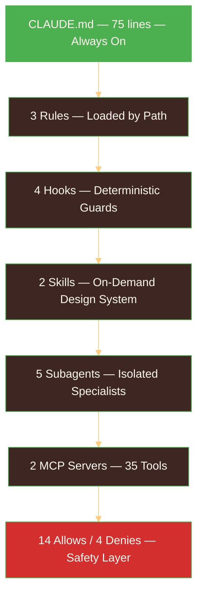

<p align="center">
  
</p>

> TechBuddy was built using Claude Code as a full development partner — not just an autocomplete engine. This document shows every primitive configured, every workflow pattern applied, and every advanced technique leveraged during six days of building.

---

## The Development Philosophy

Before writing a single line of code, we invested three hours studying how to use Claude Code effectively. Two sources shaped everything:

### Cat Wu (Claude Code Product Lead) — Hackathon AMA, Feb 11

Direct insights from the product lead during the hackathon kickoff:

- **"Less scaffolding = better results."** The Claude Code team removed 30-40% of their prompt harness and got *higher quality* output. Don't over-specify in CLAUDE.md. Keep it tight.
- **"Tool names must be DEAD OBVIOUS to the model."** The #1 failure mode for tool selection is overlapping or confusing tool names. Ask Claude: "Would you pick the right tool from this name alone?"
- **"Claude Code Guide Agent is the most underused feature."** When you need to create a hook, skill, or subagent — don't write it manually. Use the guide agent. It knows the exact formats.
- **Meta-prompting works.** "Give me a detailed prompt for building X, then execute that prompt" outperforms direct prompting. The team doesn't fully know why — they think the model may get a signal to pay more attention.
- **"Adding primitives is destructive."** They only add a new primitive when someone "hacking around found something to solve a real pain point" — not a nice-to-have. Every primitive that exists solves a real problem.

### Boris Cherny (Claude Code Creator) — Published Workflow

- **Plan Mode → Iterate → Auto-accept → 1-shot.** Enter plan mode. Have Claude map the approach. Iterate until the plan is solid. Switch to normal mode with auto-accept. Claude usually 1-shots the implementation.
- **"The single highest-leverage thing is giving Claude a way to verify its work."** Always include test cases, expected outputs, success criteria. Without verification, Claude produces plausible but possibly broken code.
- **Parallel sessions for independent modules.** Multiple terminal tabs, one per feature. Numbered tabs with system notifications when any needs input.

### The Meta-Insight (From 13 Anthropic Docs Synthesized)

> Everything in the Anthropic ecosystem is about **managing a finite attention budget**. The 200K context window is the scarce resource. Every advanced feature — subagents, progressive skill disclosure, hooks, compaction — exists to control what tokens are present at inference time and when.

---

## The 7 Claude Code Primitives

TechBuddy uses every established Claude Code primitive in its correct role. Each one solves a real problem — not a nice-to-have (Cat Wu's philosophy).



---

### 1. CLAUDE.md — Always-On Project Context

**File:** `CLAUDE.md` (75 lines)
**What it does:** Loaded every time Claude Code starts a session. Gives Claude the full project context without being told.

**Cat Wu's rule:** *"Would removing this line cause Claude to make mistakes? If not, cut it."*

Started at 48 lines on Day 0. Grew to 75 lines as real bugs were discovered and added to the Gotchas section. Every gotcha was earned — not hypothetical.

**Key sections:**

| Section | Purpose | Example |
|---------|---------|---------|
| **Architecture** | System overview so Claude understands the codebase | "35 tools with tiered fallback: win32com → pywinauto → MCP → Claude Vision" |
| **Accessibility Standards** | Non-negotiable rules Claude can't violate | "Min font: 18px. Min touch target: 48px. Plain language only — no jargon ever." |
| **Commands** | How to run/test (Claude can't guess these) | `cd ~/techbuddy && venv/bin/python frontend/app.py` |
| **Project Gotchas** | Every bug Claude caused, added as permanent instruction | "adaptive thinking has NO budget_tokens", ".env needs LF not CRLF" |
| **When Compacting** | What to preserve during context compression | "Preserve: modified files list, current module, tiered fallback architecture" |

The Gotchas section is the most important. Every entry represents a real mistake that cost hours to debug:

```markdown
## Project Gotchas
- Computer Use API scores 22% on desktop — never depend on it, always use tiered fallback
- Hook scripts: JSON on stdin, JSON on stdout, exit code 2 = block action
- Hooks go in `.claude/settings.json` NOT a separate hooks.json file
- `PostToolUseFailure` does NOT exist — use `PostToolUse` and check for errors
- MCP tool matcher format: `mcp__servername__toolname`
- Scam Shield scoring: `_scan_for_scam()` returns SAFE (0 flags), SUSPICIOUS (1-2), DANGEROUS (3+)
- Real Gmail: IMAP folder name is `"Tech Buddy Demo"` (with spaces, quoted)
- type_text for Word: win32com `Selection.TypeText()` preferred over pywinauto
```

Each line is Boris Cherny's advice in practice: *"Add every mistake Claude makes so it doesn't repeat."*

---

### 2. Rules — Path-Conditional Context

**Directory:** `.claude/rules/` (3 files)
**What they do:** Auto-loaded based on which files Claude is editing. Frontend rules only load when working on frontend code. MCP rules only load when working on MCP servers.

**Key insight:** Rules are CONDITIONAL. They don't waste context tokens when you're working on unrelated files.

#### `accessibility.md`
```yaml
---
paths:
  - "frontend/**"
  - "**/*.html"
  - "**/*.css"
---
```
Enforces: 18px min font, 48px min touch target, 4.5:1 contrast, plain language only, max 3 steps to any action, voice input + TTS always available. Only activates when Claude touches frontend code.

#### `mcp-servers.md`
```yaml
---
paths:
  - "mcp_servers/**"
---
```
Enforces Cat Wu's #1 rule: tool names must be DEAD OBVIOUS. No overlapping functionality. Tool descriptions 3-4+ sentences minimum. Return structured data, not prose. Tiered fallback pattern.

#### `hooks.md`
```yaml
---
paths:
  - "hooks/**"
---
```
Enforces the hook contract: JSON on stdin, JSON on stdout, exit 0 = success, exit 2 = BLOCK. Must complete within 60 seconds. No interactive prompts.

---

### 3. Hooks — Deterministic Safety Pipeline

**Config:** `.claude/settings.json`
**What they do:** Unlike CLAUDE.md (advisory — Claude *should* follow), hooks are **deterministic and guaranteed to run**. They execute shell scripts at lifecycle events.

Four hook types configured:

#### SessionStart — Context Recovery
```json
{
  "hooks": [{
    "type": "command",
    "command": "git -C $CLAUDE_PROJECT_DIR status --short 2>/dev/null; echo '---'; cat $CLAUDE_PROJECT_DIR/TODO.md 2>/dev/null || echo 'No TODO.md yet'"
  }]
}
```
Every time Claude Code starts or resumes a session, it sees: current git status + the project TODO. No "where were we?" — Claude already knows.

#### PreToolUse — Send Validation (`hooks/validate_send.py`)
```json
{
  "matcher": "mcp__email-provider__send_email",
  "hooks": [{
    "type": "command",
    "command": "python $CLAUDE_PROJECT_DIR/hooks/validate_send.py"
  }]
}
```
Intercepts every email and SMS send *before execution*. Checks for:
- **Scam phrases** — "act now", "send money", "wire transfer", "gift card", "verify your identity" (14 phrases)
- **Bad recipients** — malformed email addresses
- **Suspicious links** — shortened URLs (bit.ly, tinyurl, t.co)

Exit code 2 = **BLOCK the send**. The email never leaves. Claude sees the block reason and explains to the user why the send was prevented.

#### PostToolUse — Accessibility Check (`hooks/accessibility_check.py`)
```json
{
  "matcher": "Write|Edit",
  "hooks": [{
    "type": "command",
    "command": "python $CLAUDE_PROJECT_DIR/hooks/accessibility_check.py"
  }]
}
```
Runs after every Write or Edit to frontend files. Scans for:
- Font sizes below 18px
- Jargon in user-facing strings ("navigate to", "authenticate", "credentials", "interface", "toggle")

Exit code 0 = **warn but don't block**. Claude sees the warning and can self-correct. This trains Claude to write accessible code without breaking the workflow.

#### Stop — Safety Verification (`hooks/verify_elderly_safe.py`)
```json
{
  "hooks": [{
    "type": "command",
    "command": "python $CLAUDE_PROJECT_DIR/hooks/verify_elderly_safe.py"
  }]
}
```
Runs when Claude finishes responding. Checks the last 5 tool calls for failed sends or deletes — making sure no dangerous incomplete state is left. For elderly users, an unsent draft that disappears or a half-deleted file is not acceptable.

---

### 4. Skills — On-Demand Design System

**Directory:** `.claude/skills/` (2 skill directories)
**What they do:** Provide specialized expertise that Claude loads only when needed. Progressive disclosure: ~50 tokens for discovery, ~5,000 tokens on activation.

#### `interface-design/SKILL.md` — Warmth & Approachability

A complete design token system for elderly users:

```css
--bg-page: #FFF8F0;           /* Warm cream */
--bg-user: #E3F2FD;           /* Soft blue — user messages */
--bg-assistant: #FFF3E0;      /* Warm peach — assistant messages */
--bg-family: #E8F5E9;         /* Soft green — family SMS */
--accent-primary: #4CAF50;    /* Friendly green */
--font-size-body: 20px;
--touch-min: 48px;
```

Plus 6 principles: "Every element must be obvious." "Warmth over precision." "Breathing room." "High contrast text." "Consistent visual language." "Forgiving interactions."

And an avoid list: pure white backgrounds (use warm cream), harsh borders, small text, rapid animations (dizziness risk), dark mode (elderly prefer light), complex navigation.

#### `frontend-design/SKILL.md` — Anti-AI Aesthetic

Guards against generic "AI slop" — the cookie-cutter design that makes every AI-built interface look the same. Enforces: intentional typography (no Inter/Roboto), cohesive color theory, high-impact motion moments, generous negative space.

**Key insight:** Skills are shared across all subagents but loaded on demand. A subagent building the email module gets the interface-design skill activated when it touches the UI — without permanently consuming context tokens.

---

### 5. Subagents — Domain Specialists

**Directory:** `.claude/agents/` (5 configs)
**What they do:** Provide focused context when Claude Code switches between development domains. Each agent has a specialized system prompt, model selection, and skill references.

| Agent | Focus | Key Pattern |
|-------|-------|-------------|
| **email-assistant** | Read/send email, scam detection | "Read subject lines first, don't open all. Confirm recipient before sending." |
| **files-assistant** | File search (#1 senior pain point) | "Search by partial name. Sort by date for 'I just saved it' requests." |
| **photo-manager** | Find/view/share photos | "Photos are deeply personal — treat every request with care and warmth." |
| **printing-helper** | Print + troubleshoot | "Confirm before printing large documents (avoid wasting paper/ink)." |
| **video-call-helper** | Join Zoom/Meet/FaceTime | Reassurance phrases: "Everyone can see you smiling!" |

**Key insight:** These are for Claude Code development context, not runtime delegation. When building the email module, the email-assistant agent's prompt guides Claude's thinking about scam detection workflows and confirmation patterns. The subagent's specialized knowledge shapes how the production code is written.

Each agent uses `model: sonnet` (faster, cheaper for development tasks) and `permissionMode: acceptEdits` (auto-accept file changes).

---

### 6. MCP Servers — Tool Connectivity

**Config:** `.mcp.json`

```json
{
  "mcpServers": {
    "filesystem": {
      "command": "npx",
      "args": ["-y", "@modelcontextprotocol/server-filesystem", "/home/g12"],
      "description": "Read, write, search, and manage files on the user's computer"
    },
    "screen-dispatch": {
      "command": "python",
      "args": ["mcp_servers/screen_dispatch.py"],
      "description": "Execute desktop actions through tiered fallback: win32com, pywinauto, MCP, or Vision"
    }
  }
}
```

Two servers — one standard, one custom:

- **filesystem** — Standard NPX package. File operations, directory listing, search. No custom code needed.
- **screen-dispatch** — Custom Python MCP server (2,772 lines, 35 tools). The tiered fallback architecture. Platform-aware (Windows/WSL/Linux detection). This is TechBuddy's core innovation.

**Cat Wu's advice:** "Keep MCP servers to 5-6 max to avoid context bloat." We started with plans for 5 servers, consolidated to 2. The screen-dispatch server handles everything — email, files, vision, scam analysis, web search, system health, phone control — through one unified interface.

---

### 7. Permissions — Safety Guardrails

**Config:** `.claude/settings.json`

```json
{
  "permissions": {
    "allow": [
      "Bash(python *)", "Bash(npm *)", "Bash(npx *)",
      "Bash(pip install *)", "Bash(pytest *)", "Bash(ruff *)",
      "Bash(git add *)", "Bash(git commit *)", "Bash(git status*)",
      "Bash(git diff*)", "Bash(git log*)",
      "Bash(ls *)", "Bash(mkdir *)", "Bash(cp *)"
    ],
    "deny": [
      "Bash(rm -rf *)",
      "Bash(git push --force*)",
      "Bash(git reset --hard*)",
      "Read(.env*)"
    ]
  }
}
```

**14 allow rules** pre-approve safe operations. Without these, you'd be prompted for every `pytest`, every `git status`, every `ls`. The constant interruptions break flow.

**4 deny rules** are non-negotiable:
- `rm -rf` — No recursive deletes. Ever.
- `git push --force` — No force pushes that destroy remote history.
- `git reset --hard` — No discarding uncommitted work.
- `Read(.env*)` — API keys stay out of context. Claude doesn't need to see them.

**Evaluation order:** Deny > Ask > Allow. First match wins. Deny rules are checked before allow rules — safety can't be overridden.

---

## Workflow Patterns

Configuration is setup. These are the patterns used *during* development.


### Plan Mode → Iterate → Execute

Boris Cherny's workflow, used for every major feature:

1. **Enter Plan Mode** (Shift+Tab twice) — Claude explores the codebase, reads files, understands context
2. **Iterate on the plan** — Ask questions, clarify requirements, consider alternatives
3. **Exit Plan Mode** — Switch to normal mode with auto-accept edits enabled
4. **Claude 1-shots the implementation** — Because the plan is solid, execution is linear

This pattern was used for: the tiered fallback architecture, scam shield pipeline, Gmail IMAP integration, iOS phone control, the entire UI redesign, and every documentation file.

### Research Before Code

Invested ~3 hours on research before writing a single line of code:

| Source | What We Learned |
|--------|----------------|
| 13 Anthropic docs | Context engineering, complexity ladder, tool design, multi-agent patterns, hooks, skills, prompting |
| Cat Wu's hackathon AMA | Tool naming, meta-prompting, less scaffolding, Claude Code Guide Agent |
| Boris Cherny's workflow | Plan mode, verification as #1 priority, parallel sessions |
| IndyDevDan's architecture | Multi-agent orchestration, MCP server design |
| Computer Use API research | 22% desktop success rate — led to tiered fallback decision |

**Result:** All 5 modules (planned for end of Day 3) were completed on Day 0/1 evening — **2.5 days ahead of schedule**.

> *"Planning time and coding time have an inverse relationship. Every hour spent on research and architecture saves 3-4 hours of coding and debugging."*

### Verification as the #1 Priority

Boris Cherny: *"The single highest-leverage thing is giving Claude a way to verify its work."*

- **143 tests** across 5 test files, run after every code chunk
- Tests caught real bugs: Flask session serialization (`TextBlock` not JSON-serializable), WSL path issues, IMAP folder name mismatches
- Each chunk builds on verified code — no mysterious regressions
- Test strategy: focus on highest-value, lowest-effort tests. Skip complex mocking for a hackathon. Test the things that actually break.

### Session Management

| Technique | When | Why |
|-----------|------|-----|
| `/clear` | Between unrelated tasks | Prevents context pollution from Module A leaking into Module B |
| `/clear` + rewrite | After 2+ failed corrections | Context is polluted with wrong approaches. Fresh start with better prompt |
| `/compact "Focus on X"` | Mid-session when context grows | Targeted summarization preserves what matters |
| Parallel tabs | Independent features | One tab per module. System notifications when any needs input |
| `/rename` | Name each session | Treat sessions like git branches — different workstreams get separate contexts |

### Meta-Prompting

Instead of: *"Build the email MCP server"*
Do: *"Give me a detailed prompt for building an email MCP server for elderly users, then execute that prompt"*

Cat Wu confirmed this works better but said the team doesn't fully know why. Their theory: the model may get a signal to pay more attention, or it engages "slow thinking" vs "fast thinking."

We used meta-prompting for complex features: the scam shield pipeline, the tiered fallback architecture, the UI accessibility system.

### Subagents for Investigation

When Claude researches the codebase, it reads files that consume YOUR context window. Subagents explore in separate contexts and return summaries — 50-100 tokens from 2,000+ retrieved.

Used extensively during: architecture audits, competitive analysis, documentation research, test coverage analysis.

---

## Environment Configuration

```bash
# Compact earlier to preserve working space (default is higher)
export CLAUDE_AUTOCOMPACT_PCT_OVERRIDE=60

# Maximum extended thinking budget
export MAX_THINKING_TOKENS=31999

# Maximum output per response
export CLAUDE_CODE_MAX_OUTPUT_TOKENS=64000
```

These three variables tune Claude Code's resource allocation:
- **Autocompact at 60%** — Gives more headroom before context overflow. Default is too aggressive for complex multi-file work.
- **31,999 thinking tokens** — Maximum reasoning depth for plan mode and complex decisions.
- **64K output** — Enough to write entire files without truncation.

---

## The Results

| Milestone | Planned | Actual | Delta |
|-----------|---------|--------|-------|
| Chat UI + voice + Claude API | Day 1 | Day 0/1 evening | -1 day |
| 8 dispatch tools + hooks | Day 2 morning | Day 0/1 evening | -1.5 days |
| Test suite (42 tests) | Day 2 | Day 0/1 evening | -1.5 days |
| All 5 modules complete | End of Day 3 | Day 0/1 evening | **-2.5 days** |
| Scam Shield 3-layer | Day 3 | Day 3 | On schedule |
| Gmail IMAP + Vision | Day 4 | Day 4 | On schedule |
| iOS phone control | Day 4 | Day 4 | On schedule |
| UI/UX polish | Day 5 | Day 4 | -1 day |
| Documentation (4 deep dives) | Day 6 | Day 6 | On schedule |

The initial acceleration (2.5 days ahead) came from the research investment. The later features (scam shield, Gmail, iOS, vision) took their planned time because they involved genuinely hard problems — IMAP folder name transforms, PIL black screenshots on RDP, extended thinking API changes.

**The meta-lesson:** The setup time (Day 0) wasn't overhead — it was the highest-leverage investment of the entire hackathon.

---

## The Meta-Recursion

There's a level of recursion here that's worth naming:

**Claude Code** — an AI-powered CLI — was used to build **TechBuddy** — an AI-powered assistant for elderly users.

The tool that helps **developers** navigate code complexity through natural conversation was adapted to help **elderly people** navigate digital complexity through natural conversation.

Same principle. Same architecture pattern (natural language → AI brain → deterministic tools → real action). Different audience.

Claude Code uses CLAUDE.md, rules, hooks, skills, and subagents to shape how an AI partner helps developers.
TechBuddy uses a system prompt, tool schemas, scam rules, and accessibility standards to shape how an AI companion helps elderly users.

The primitives scale.

---

<p align="center">
  <a href="ARCHITECTURE.md"></a>
  <a href="CHALLENGES.md"></a>
  <a href="LEARNINGS.md"></a>
  <a href="README.md"></a>
</p>

<p align="center">
  
</p>
