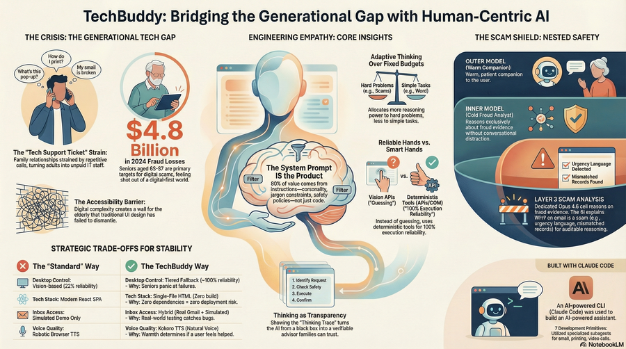
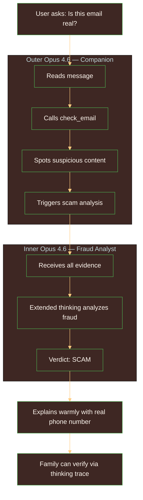
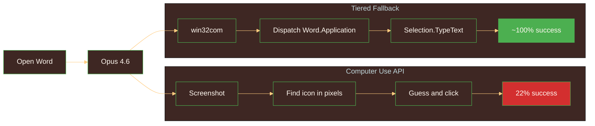

  

> What we learned about building with Claude Opus 4.6 for elderly users — the insights that shaped the architecture, the trade-offs that defined the product, and the edge cases that kept us honest.

  

  
  
  
  

---

## Surprising Discoveries About Opus 4.6

### 1. The System Prompt IS the Product

**Expected:** The code — 35 tools, tiered fallback, scam pipeline, vision — would be the main differentiator. The system prompt would just be a few lines of setup.

**Actual:** 80% of what makes TechBuddy work is the system prompt. Personality rules, 35 tool schemas, scam detection behavior, email formatting rules, proactive troubleshooting triggers, the "never use jargon" constraint, the "always confirm before sending or deleting" rule — all of it lives in the prompt. The same tools with a different system prompt would feel like a completely different product.

**Implication:** Building for Opus 4.6 is less about code and more about shaping the model's behavior through careful instruction design. TechBuddy's warmth, patience, and safety awareness aren't features we coded — they're behaviors we prompted. The system prompt is the product definition, the personality spec, and the safety policy all in one.

### 2. Adaptive Thinking Outperforms Fixed Budgets

**Expected:** Setting `thinking: {"type": "enabled", "budget_tokens": 10000}` would give consistent, predictable reasoning depth across all queries.

**Actual:** `thinking: {"type": "adaptive"}` produces better results because Opus 4.6 allocates more thinking to genuinely hard problems (ambiguous scam emails, multi-step troubleshooting) and less to simple ones ("open Word"). The model knows how hard the problem is before we do.

**Implication:** Trust the model's own judgment about how much to think. Adaptive mode isn't a convenience feature — it's a capability. A fixed budget either wastes tokens on easy problems or starves hard problems. Adaptive mode does what a good engineer would do: think harder when it matters.

### 3. Give the Model Reliable Hands, Not Smart Hands

**Expected:** Computer Use API — Anthropic's official vision-based desktop control — would be more flexible and powerful than deterministic automation tools.

**Actual:** Computer Use API scores 22% on desktop tasks. It's guessing pixel coordinates from screenshots. But Opus 4.6's intelligence is wasted on pixel-guessing. Give it deterministic tools (win32com opens Word in 100ms, every time) and the model spends its intelligence on what matters: understanding the user's intent, reasoning about whether an email is a scam, crafting a warm response that an 80-year-old can follow.

**Implication:** The best architecture pairs **model intelligence** with **deterministic execution**. The model is the smart part. The tools should be the reliable part. Don't make the AI simulate a human clicking buttons — give it APIs and let it reason about why.

### 4. Nested API Calls Unlock Safety Depth

**Expected:** One Claude API call per user message could handle everything — conversation, tool calls, and scam analysis within the same context.

**Actual:** Scam Shield Layer 3 uses a *separate* Opus 4.6 API call with its own extended thinking. This inner call receives all evidence — keyword flags, web verification results, full email content — and reasons exclusively about fraud. No conversational context to dilute its focus. The outer call then takes the scam verdict and explains it warmly to the user.

**Implication:** For safety-critical features, give Opus 4.6 a dedicated reasoning environment. Model-within-model architecture separates concerns at the AI level — the same way you'd separate concerns in code. The inner model is a fraud analyst. The outer model is a patient companion. Same Opus 4.6, different roles.

### 5. Extended Thinking Makes Transparency Possible

**Expected:** The thinking trace would be a debugging tool for developers — useful during development, hidden in production.

**Actual:** The thinking trace became a *trust* tool for family members. Sarah can open TechBuddy's "See what I was considering..." section and see exactly why it flagged an email as a scam: "The sender claims to be IRS, but the phone number doesn't match official IRS records, and the IRS never initiates contact by email. The urgency language ('immediate action required') is a common social engineering tactic."

This transparency is only possible because extended thinking externalizes the model's reasoning process. Without it, TechBuddy would just say "this is a scam" — and the family would have to trust it blindly.

**Implication:** Extended thinking isn't just about better answers — it's about **auditable answers**. For safety-critical applications protecting vulnerable users, showing the reasoning is as important as getting the right result. The thinking trace turns AI from a black box into a verifiable advisor.

---

## Trade-offs Made

### Trade-off 1: Tiered Fallback vs Computer Use API

| Factor | Computer Use API | Tiered Fallback | Winner |
|--------|-----------------|-----------------|--------|
| **Reliability** | 22% on desktop tasks | ~100% via win32com | Tiered |
| **Flexibility** | Any app, any action | Defined tools only | CU API |
| **Latency** | 3-8s (screenshot + reasoning) | <1s (direct API call) | Tiered |
| **Code complexity** | Low (one API) | High (35 tool implementations) | CU API |
| **Opus 4.6 intelligence use** | Spent on pixel-guessing | Spent on user intent + reasoning | Tiered |

**Decision:** Chose tiered fallback. The flexibility loss is manageable because elderly users have a finite set of common tasks — open Word, check email, find files, print documents. The reliability gain is non-negotiable for users who will panic at the first failure.

**In hindsight:** Would make the same choice every time. Computer Use API will improve. But building for elderly users today requires near-100% reliability, not "it works most of the time." The tiered architecture also means Opus 4.6's intelligence is focused on understanding intent and reasoning about safety — not on identifying buttons in a screenshot.

### Trade-off 2: Single-File HTML (1,157 Lines) vs React

| Factor | Single-File HTML | React | Winner |
|--------|-----------------|-------|--------|
| **Build step** | None | Webpack/Vite required | HTML |
| **Dependencies** | Zero | node_modules (~200MB) | HTML |
| **Readability** | Anyone can open and understand | Requires React knowledge | HTML |
| **Refactoring** | Hard above ~2,000 lines | Component-based, easy | React |
| **Deployment** | Copy one file | Build + deploy pipeline | HTML |

**Decision:** Chose single-file. TechBuddy is a one-page chat app, not a multi-page SPA. Zero build complexity means zero build failures during a live demo. Zero dependencies means zero supply chain risk. Anyone reviewing the code can open one HTML file and understand the entire UI.

**In hindsight:** At 1,157 lines, we're approaching the practical limit. The animated SVG avatar, per-message replay controls, and TTS integration make the file dense. A v2 would consider Preact with HTM — React-compatible API, no build step, same single-file simplicity with better organization.

### Trade-off 3: Real Gmail IMAP vs Simulated Inbox

| Factor | Real Gmail IMAP | Simulated Inbox | Winner |
|--------|----------------|-----------------|--------|
| **Demo credibility** | "This is real email" | "This is simulated" | Real |
| **Reliability** | Depends on network + credentials | Always works, zero config | Simulated |
| **Scam testing** | Real scam email in real Gmail | Pre-loaded scam email #5 | Tie |
| **Setup complexity** | App password, IMAP, folder naming | None | Simulated |

**Decision:** Chose BOTH — real Gmail IMAP as primary, simulated inbox as fallback. `USE_REAL_GMAIL=True/False` in `.env` switches between them. The simulated inbox has the same 6 demo emails (including the scam) so both paths demonstrate identical features.

**In hindsight:** Building both paths was exactly the right call. Real Gmail impresses judges ("wait, that's actual email?"). Simulated fallback saves the demo if WiFi dies or credentials expire. The only cost is maintaining two code paths — a small price for demo resilience.

### Trade-off 4: Kokoro TTS vs Browser Speech API

| Factor | Kokoro TTS | Browser Speech API | Winner |
|--------|-----------|-------------------|--------|
| **Voice quality** | Natural, warm | Robotic on some browsers | Kokoro |
| **Installation** | Separate process on port 5050 | Built into all browsers | Browser |
| **Offline support** | Requires running service | Chrome: yes; others: varies | Tie |
| **Elderly perception** | "Sounds like a real person" | "Sounds like a computer" | Kokoro |

**Decision:** Chose Kokoro TTS as primary with browser Speech API as fallback. The voice is how elderly users perceive TechBuddy's personality — warm and natural, not robotic and cold. When grandma hears "Hello, Margaret! Let me check your email," the voice quality determines whether she feels helped or talked down to.

**In hindsight:** Would add a third tier — pre-recorded audio for common greetings and transitions. "Hello, Margaret!" should sound identical and warm every single time, regardless of which TTS engine is running.

---

## Edge Cases Handled

| Edge Case | What Broke | Solution |
|-----------|-----------|----------|
| Flask cookie overflow (582KB) | Conversation silently resets — no error | Server-side sessions with UUID-keyed dict |
| Gmail IMAP folder name transform | `tech-buddy-demo` becomes `"Tech Buddy Demo"` | Double-quoted folder names in IMAP SELECT |
| imaplib >1MB response crash | CPython bug #90378 buffer overflow | `SINCE` date filter limits email results |
| .env CRLF line endings on WSL | API key has invisible `\r` appended | `.strip()` all values loaded from .env |
| PIL.ImageGrab black on RDP | No composited display buffer to capture | Mac-side xcrun pipeline via Cloudflare Tunnel |
| strftime `%-d` vs `%#d` | Linux and Windows use different date format flags | Runtime platform detection |
| Base64 screenshots in session | 200KB+ per screenshot stored in history | `_strip_image_data()` replaces with `[screenshot taken]` |
| Extended thinking blocks in history | 5-30KB per thinking block bloats context | `_compact_history()` trims old thinking blocks |
| Cloudflare Tunnel URL changes | URL regenerates every tunnel restart | `PHONE_SERVER_URL` in .env, verify before each demo |
| DuckDuckGo package rename | `duckduckgo_search` package became `ddgs` | Updated import with fallback for compatibility |

---

## What I Would Do Differently

1. **Start with server-side sessions from Day 1** — Client-side cookies were a ticking time bomb. They only exploded after extended thinking and vision were integrated — when Opus 4.6's rich reasoning traces (5-30KB per thinking block) overflowed the 4KB cookie limit. Cookie limits are well-documented. For any application that stores AI reasoning in session state, server-side storage should be the default from the start.

2. **Use win32com as Tier 1 from the start** — We spent two days building pywinauto-based automation before discovering that COM automation was dramatically more reliable for Office applications. The lesson: always check if the application has a programmatic API before resorting to UI automation. Word, Excel, and Outlook all have rich COM interfaces. Sending keystrokes to a window is the backup plan, not the primary path.

3. **Build real Gmail integration earlier** — The simulated inbox masked bugs that only appeared with real email: folder name mismatches, IMAP buffer crashes, authentication edge cases, date format platform differences. Simulated demos that "always work" feel safe — but they prevent you from discovering the bugs that matter. Test with real systems early, even when it's harder.

---

## Built with Claude Code

TechBuddy was built using Claude Code — and it uses **all 7 Claude Code development primitives**:

| Primitive | Implementation | Purpose |
|-----------|---------------|---------|
| **CLAUDE.md** | 75-line project blueprint | Architecture, tools, accessibility standards, known gotchas |
| **Rules** | 3 files in `.claude/rules/` | WCAG accessibility, hook development, MCP server design |
| **Hooks** | 3 scripts in `hooks/` | PreToolUse: validate sends. PostToolUse: accessibility check. Stop: safety verify |
| **Skills** | 4 configs in `.claude/skills/` | Interface design, frontend design, accessibility checking, elderly-prompt formatting |
| **Subagents** | 5 configs in `.claude/agents/` | Email, files, photos, printing, video calls — specialized development context |
| **MCP Servers** | 2 in `.mcp.json` | Filesystem (NPX standard), screen-dispatch (custom Python, 35 tools) |

There's a meta-level recursion here: Claude Code — an AI-powered CLI — was used to build TechBuddy — an AI-powered assistant for elderly users. The tool that helps developers navigate code complexity was adapted to help elderly people navigate digital complexity. Same principle, different audience.

---

*Built over six days for Anthropic's Built with Opus 4.6 hackathon. Every insight above was earned through real building, real testing, and real iteration — not hypothetical planning.*

  
  
  
  

