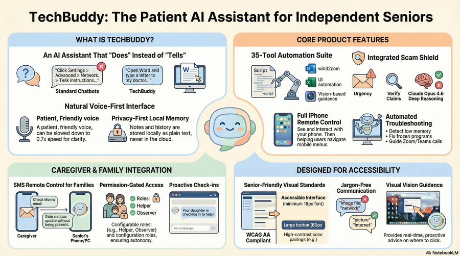
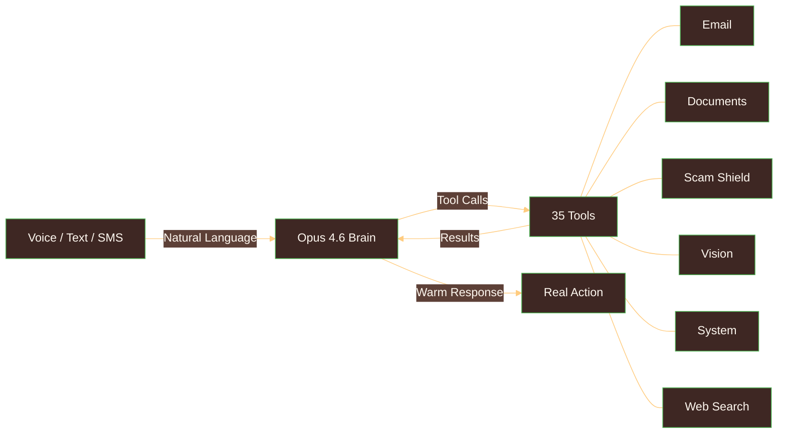

<p align="center">
  
</p>

<p align="center">
  
</p>

<p align="center">
  
  
  
</p>

<p align="center">
  You know how <strong>Claude Code</strong> helps developers work with their computers through natural conversation?<br/>
  <strong>TechBuddy is that — but for the 60+ generation.</strong>
</p>

<p align="center">
  <a href="ARCHITECTURE.md">Architecture</a> · <a href="CHALLENGES.md">Challenges</a> · <a href="LEARNINGS.md">Learnings</a> · <a href="CLAUDE_CODE.md">Claude Code</a> · <a href="CLAUDE.md">CLAUDE.md</a>
</p>

---

<p align="center">
  
</p>

## The Problem

**55 million** Americans are over 65.
**25%** don't use the internet at all.
**59%** are unfamiliar with copy and paste.
**$4.9 billion** lost to internet scams targeting seniors in 2024.
**77 hours/month** — average caregiver tech support burden.

---

## You talk. Opus 4.6 understands. The computer does it.

Your mother says *"help me find that photo from Christmas."* Claude Opus 4.6 understands what she means, searches her files, finds the photo, and shows it to her. No menus. No jargon. No calling you for help.

| Your parent says... | Opus 4.6 decides and acts | The computer does it |
|---|---|---|
| "Check my email" | Connects to Gmail, reads subjects, summarizes what's new | Reads emails aloud, highlights important ones |
| "Help me write a letter to my friend" | Opens Word via COM automation, positions cursor | Types the letter, saves it |
| "My printer isn't working" | Runs PowerShell diagnostics, finds stuck print queue | Clears the queue, confirms it's printing |
| "Can you help me join the Zoom call?" | Searches email for meeting link, identifies PMI | Opens Zoom, walks through joining step by step |
| "Is this email real or a scam?" | 3-layer analysis with extended thinking and web verification | Explains *why* it's a scam, gives the real phone number |
| "Remember my doctor is Dr. Patel" | Saves to local TechBuddy Notes — private, never in the cloud | Recalls it next time: "Your doctor is Dr. Patel" |

**This isn't Computer Use API guessing pixel coordinates (22% success rate).** We gave Claude Opus 4.6 deterministic tools — `win32com`, `imaplib`, `PowerShell`, `PIL` — so the brain controls the computer with **near-100% reliability**. Same intelligence. Better hands.

---

## Demo

<p align="center">
  <a href="#">
    
  </a>
</p>

> Demo video link will be added before submission.

<p align="center">
  <a href="assets/TechBuddy_Restoring_Independence.pdf">
    
  </a>
</p>

---

## Claude Opus 4.6: The Brain

Every interaction routes through Claude Opus 4.6. The 35 tools are hands. **The model is the mind.**

Opus 4.6 doesn't follow scripts. It reads a request, chooses the right tools, interprets results, and chains actions — finding files, writing letters, navigating email, troubleshooting printers, joining Zoom calls. The 10-round tool-use loop gives Opus 4.6 space to reason through multi-step problems autonomously. **No code tells it what to do next.**

For example, when a user asks about a suspicious email, Opus 4.6 autonomously triggers `analyze_scam_risk()`, launches a **nested Opus 4.6 call** with its own extended thinking for deep analysis, verifies claims via `search_web()`, and writes a warm explanation with the real phone number to call instead — all without any hardcoded orchestration.

### Five Capabilities in Production

| Capability | How TechBuddy Uses It |
|---|---|
| **Extended Thinking (Adaptive)** | Adapts reasoning depth to each task — quick decisions for simple requests, deep analysis for complex problems like scam detection or multi-step troubleshooting. Scam Shield uses a *nested* Opus 4.6 call with its own thinking chain. Thinking traces surfaced in UI so family can verify decisions. |
| **Vision (2 pipelines)** | PIL screenshots of Windows desktop + xcrun screenshots of iPhone via Cloudflare Tunnel. Opus 4.6 interprets what's on screen, identifies UI elements, and guides users step-by-step through anything automation can't reach. |
| **Tool Use (35 tools, 10 rounds)** | Opus 4.6 autonomously selects and chains tools across rounds. It reads results, decides next actions, handles errors by trying alternatives — all emergent from the model's reasoning. |
| **Prompt Caching** | System message (personality + 35 tool schemas + safety rules) cached with `cache_control: {"type": "ephemeral"}` for faster repeat calls within a session. |
| **Personality via System Prompt** | 80% of what makes TechBuddy work is the system prompt. Warmth, patience, jargon-free language, proactive help, and the rule to always confirm before sending, deleting, or taking financial action — all shaped through prompt engineering. The same tools with a different prompt would be a different product. |

### The Key Insight

> **The system prompt IS the product.** Opus 4.6 becomes TechBuddy through careful instruction design — warm personality, safety awareness, proactive troubleshooting, accessibility rules. The code gives Opus 4.6 reliable hands. The system prompt gives it a soul.

---

## Architecture



**Natural language goes in. Opus 4.6 reasons. Real things happen.** The brain decides which tools to call, interprets every result, and autonomously chains actions across up to 10 rounds. The tools never make decisions — Opus 4.6 does.

<p align="center">
  <a href="ARCHITECTURE.md">
    
  </a>
</p>

---

## By the Numbers

<table>
<tr>
<td align="center"><h3>35</h3>Tools</td>
<td align="center"><h3>143</h3>Tests</td>
<td align="center"><h3>~7,100</h3>Lines of Code</td>
<td align="center"><h3>8</h3>Challenges Solved</td>
<td align="center"><h3>6</h3>Days</td>
<td align="center"><h3>1</h3>Brain (Opus 4.6)</td>
</tr>
</table>

### Built with Every Claude Code Primitive

| Primitive | What | Why |
|---|---|---|
| **[CLAUDE.md](CLAUDE.md)** | 75-line project blueprint | Architecture, tools, accessibility, gotchas — all in one file |
| **Rules** | 3 files in `.claude/rules/` | WCAG accessibility, hook development, MCP server design |
| **Hooks** | 3 scripts in `hooks/` | Validate sends, check accessibility, verify safety |
| **Skills** | 2 in `.claude/skills/` | Interface design, frontend design |
| **Subagents** | 5 in `.claude/agents/` | Email, files, photos, printing, video calls |
| **MCP Servers** | 2 in `.mcp.json` | Filesystem (NPX), screen-dispatch (custom, 35 tools) |

---

## Deep Dives

<table>
<tr>
<td align="center">

**[Architecture](ARCHITECTURE.md)**

<strong>System design, data flows, component breakdown, Mermaid diagrams, every design decision explained.</strong>

</td>
<td align="center">

**[Challenges](CHALLENGES.md)**

<strong>8 real problems from 6 days of building. Each one looked simple. None of them were.</strong>

</td>
<td align="center">

**[Learnings](LEARNINGS.md)**

<strong>Surprising discoveries about Opus 4.6, trade-offs made, edge cases handled, what we'd do differently.</strong>

</td>
<td align="center">

**[Claude Code Setup](CLAUDE_CODE.md)**

<strong>Every primitive, workflow pattern, and advanced technique used to build TechBuddy with Claude Code.</strong>

</td>
<td align="center">

**[CLAUDE.md](CLAUDE.md)**

<strong>The actual 75-line project blueprint that Claude Code reads every session. The project's DNA.</strong>

</td>
</tr>
</table>

---

## Quick Start

```bash
git clone https://github.com/ges257/techbuddy.git
cd techbuddy
python -m venv venv && source venv/bin/activate
pip install -r frontend/requirements.txt
```

Create a `.env` file:
```bash
ANTHROPIC_API_KEY=your-key-here
# Optional: Real Gmail
USE_REAL_GMAIL=False
```

Run:
```bash
python frontend/app.py
# Open http://localhost:5000
```

---

## Project Structure

```
techbuddy/
├── frontend/
│   ├── app.py                    # Flask + Claude Opus 4.6 API (1,044 lines)
│   └── templates/chat.html       # Full accessible UI (1,157 lines)
├── mcp_servers/
│   └── screen_dispatch.py        # 35 tool implementations (2,772 lines)
├── hooks/                        # 3 Claude Code hook scripts
├── tests/                        # 143 tests across 5 files
├── .claude/                      # Rules, skills, subagents
├── CLAUDE.md                     # Project blueprint
├── ARCHITECTURE.md               # System design deep dive
├── CHALLENGES.md                 # 8 real challenges, solved
└── LEARNINGS.md                  # Insights and trade-offs
```

---

<p align="center">
  
  
  
  
</p>

<p align="center">
  Built by <a href="https://github.com/ges257">Gregory E. Schwartz</a> for <a href="https://cerebralvalley.ai/e/built-with-claude-opus-4-5-a-claude-code-hackathon-VfMGlFoBShaBmI3ORafd">Built with Opus 4.6: a Claude Code Hackathon</a><br/>
  February 10–16, 2026
</p>

<p align="center">
  
</p>
